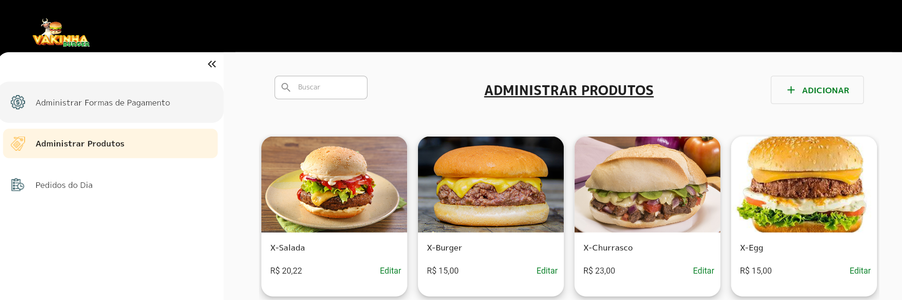
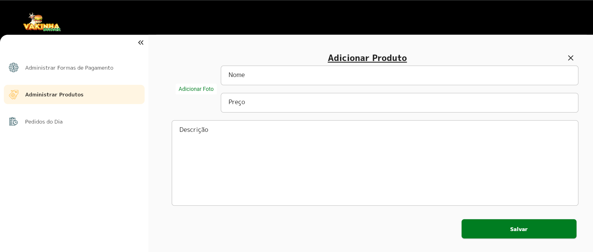
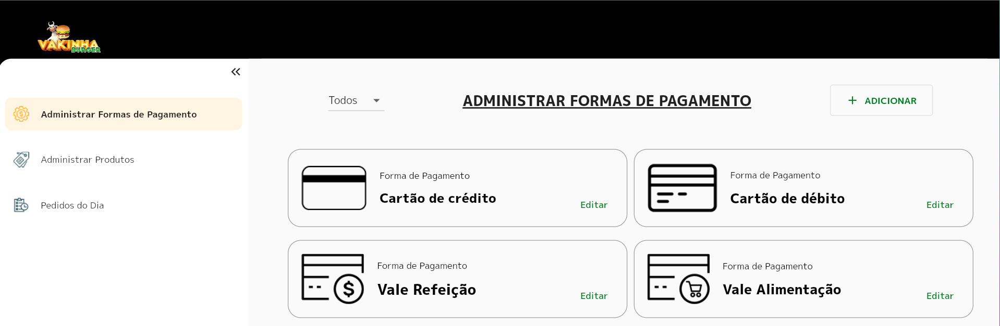
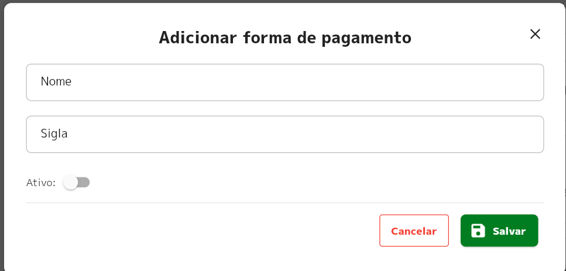
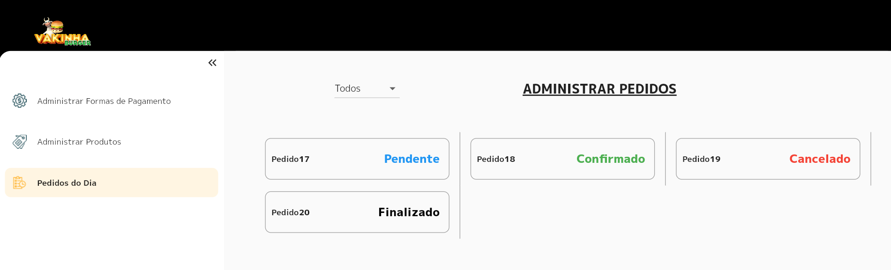
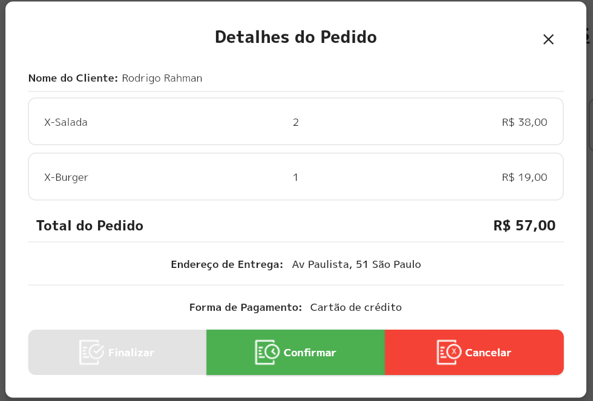

<p align="left">


  
  
  
  

</p>


### Tópicos 

:small_blue_diamond: [Sobre o Projeto](#star-sobre-o-projeto)

:small_blue_diamond: [Objetivo](#dart-objetivo)

:small_blue_diamond: [Imagens](#sunrise_over_mountains-imagens)

:small_blue_diamond: [Pacotes Utilizados](#gear-pacotes-utilizados)

:small_blue_diamond: [Como rodar a aplicação](#arrow_forward-como-rodar-a-aplicação)

## :star: Sobre o Projeto 

Aplicação desenvolvida durante a Dart Week 11, evento gratuito organizado pela Academia do Flutter (https://academiadoflutter.com.br/).

Este projeto foi desenvolvido utilizando:

:heavy_check_mark: Flutter Web
:heavy_check_mark: Modular para gerenciamento de estado e injeção de dependência.
:heavy_check_mark: json_rest_server para simualação de um back-end.

## :dart: Objetivo

Desenvolvimento de um sistema completo de backoffice utilizando Flutter WEB com arquitetura MVC com Designer Pattern Repostiory e Service utilizando os package Modular e MobX


### Funcionalidades Implementadas:

:white_check_mark: **Cadastro de Formas de Pagamento**
  - Permite a inclusão de uma forma de pagamento

:white_check_mark: **Cadastro de Produtos**
  - Permite a inclusão de um novo produto

:white_check_mark: **Pedidos do Dia**
  - Permite acompanhar os pedidos do dia, filtrando por status.

:white_check_mark: **Login** 
  - Utilizando access token para autenticação
  
## :sunrise_over_mountains: Imagens

### :iphone: Mobile


#### :white_check_mark: Login


#### :white_check_mark: Produtos

##### Todos os Produtos


#####  Novo Produto



####  :white_check_mark: Formas de Pagamento

##### Todas as Formas de Pagamento


##### Nova Forma de Pagamento



####  :white_check_mark: Pedidos

##### Todos os Pedidos


##### Detalhes do Pedido


## :gear: Pacotes Utilizados 

### :station: Server
- :white_check_mark:[Json Rest Server](https://pub.dev/packages/json_rest_server)


### :iphone: Web

- :white_check_mark:[dio](https://pub.dev/packages/dio)

- :white_check_mark:[flutter_modular](https://pub.dev/packages/flutter_modular)

- :white_check_mark:[mobx](https://pub.dev/packages/mobx)

- :white_check_mark:[flutter_dotenv](https://pub.dev/packages/flutter_dotenv)

- :white_check_mark:[flutter_mobx](https://pub.dev/packages/flutter_mobx)

- :white_check_mark:[loading_animation_widget](https://pub.dev/packages/loading_animation_widget)

- :white_check_mark:[awesome_snackbar_content](https://pub.dev/packages/awesome_snackbar_content)

- :white_check_mark:[brasil_fields](https://pub.dev/packages/brasil_fields)

- :white_check_mark:[validatorless](https://pub.dev/packages/validatorless)

- :white_check_mark:[build_runner](https://pub.dev/packages/build_runner)

- :white_check_mark:[mobx_codegen](https://pub.dev/packages/mobx_codegen)


## :arrow_forward: Como rodar a aplicação 

#### :warning: Pré-Requisitos

- [Git](https://git-scm.com/)

#### :heavy_check_mark: Clonando o Projeto

No terminal, clone o projeto: 

```
https://github.com/dgo-angelo/dw10_vakinha_burger_web.git
```

### :station: Server

#### :warning: Pré-Requisitos

- :link: [Dart](https://dart.com)


#### :arrow_forward: Executando a aplicação

1) Acessar a pasta ```server``` do projeto
2) Executar o comando abaixo, que disponibilizará a api no endereço http://localhost:8080
```
json_rest_server run
```

3) A API disponibiliza os seguintes endpoints:

| Método                             | Verbo HTTP | Endpoint                                 | Autenticação? |
|------------------------------------|------------|------------------------------------------|---------------|
| Cria um novo produto               | POST       | http://localhost:8080/products           | Sim           |
| Atualiza um produto                | PUT        | http://localhost:8080/products/{id}      | Sim           |
| Lista todos os produtos            | GET        | http://localhost:8080/products           | Sim           |
| Retorna um produto por ID          | GET        | http://localhost:8080/products/{id}      | Sim           |
| Deleta um produto                  | DELETE     | http://localhost:8080/products/{id}      | Sim           |
| Login                              | POST       | http://localhost:8080/login              | Não           |
| Upload da Imagem do produto        | POST       | http://localhost:8080/upload             | Sim           |
| Cria uma nova forma de pagamento   | POST       | http://localhost:8080/payment-types      | Sim           |
| Lista todas as formas de pagamento | GET        | http://localhost:8080/payment-types      | Sim           |
| Retorna forma de pagamento por ID  | GET        | http://localhost:8080/payment-types/{id} | Sim           |
| Deleta uma forma de pagamento      | DELETE     | http://localhost:8080/payment-types/{id} | Sim           |
| Atualiza uma forma de pagamento    | PUT        | http://localhost:8080/payment-types/{id} | Sim           |
| Lista todos os pedidos             | GET        | http://localhost:8080/orders             | Sim           |
| Retorna um pedido por ID           | GET        | http://localhost:8080/orders/{id}        | Sim           |
| Atualiza um pedido                 | PUT        | http://localhost:8080/orders/{id}        | Sim           |
| Deleta um pedido                   | DELETE     | http://localhost:8080/orders/{id}        | Sim           |

### :iphone: Web

#### :warning: Pré-Requisitos

- [Dart](https://dart.dev/get-dart)
- [Flutter](https://docs.flutter.dev/get-started/install)

#### :arrow_forward: Executando a aplicação

Acessar o arquivo main.dart, e pressionar F5, ou executar o comando abaixo na raiz do projeto: 

```
 flutter run
```

<hr/>